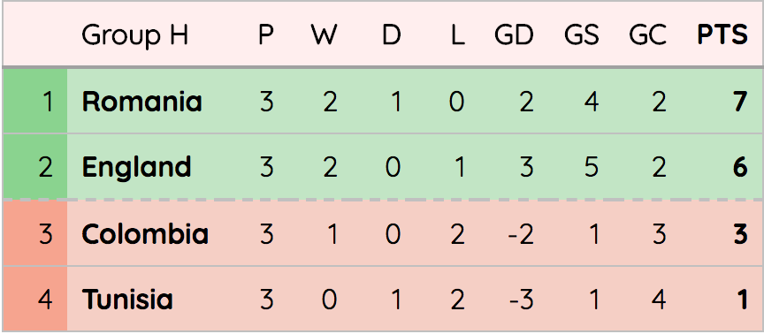
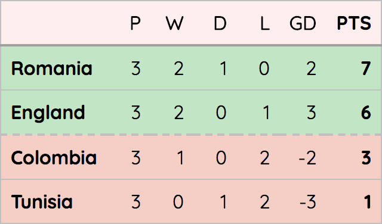

# react-group-table
A simple React component that can be used to display football league tables. It was written with small tables (i.e. 4 team World Cup groups) in mind, but you can use it for as many teams as you like.

## Usage
If you want to include this component in your React app, install from `npm` with
```
npm i --save react-group-table
```
Import wherever you want to use it with
```
import GroupTable from 'react-group-table'
```
This gives you a standard React component:
```
<GroupTable {...this.props}>
```

## Props
`react-group-table` has some mandatory props and some optional props.

|Prop Name|Prop Type|Required|Default|Usage|
|:---:|:---:|:---:|:---:|:---:|
|`cutOffPositions`|Array of numbers|:negative_squared_cross_mark:|`[2]`|Adds a dashed border under any position in this array to indicate cut off positions, e.g. between qualifying and non-qualifying positions. Not zero indexed so if you want a cut off position after the second and fourth team, the array will be `[2,4]`|
|`dangerZonePositions`|Array of numbers|:negative_squared_cross_mark:|`[3,4]`|These positions will be shaded red to indicate non-qualifying/relegation positions|
|`groupName`|String|:negative_squared_cross_mark:||Group name to be displayed above team names|
|`qualificationPositions`|Array of numbers|:negative_squared_cross_mark:|`[1,2]`|These positions will be shaded green to indicate qualification positions (or similar)|
|`pointsForWin`|number|:negative_squared_cross_mark:|3|In case you want to render old tables from the days of 2 points for a win, or some dystopian future with 7 points for a win or something|
|`showGoalsConceded`|bool|:negative_squared_cross_mark:|`true`|Display the goals conceded column|
|`showGoalsScored`|bool|:negative_squared_cross_mark:|`true`|Display the goals scored column|
|`showPositions`|bool|:negative_squared_cross_mark:|`true`|Display the league position column|
|`teams`|Array of object (see below)|:white_check_mark:||List of teams and their stats for the group table|

### The 'teams' array
The most important prop is an array of team objects. There can be as many teams as you want, but each can have the following properties (note some are mandatory):
```
{
  gamesDrawn: number.isRequired,
  gamesLost: number.isRequired,
  gamesPlayed: number,
  gamesWon: number.isRequired,
  goalDifference: number,
  goalsConceded: number.isRequired,
  goalsScored: number.isRequired,
  points: number,
  teamName: string.isRequired
}
```

### With all columns shown, group name supplied, default qualification and danger zone positions



### With only mandatory columns shown, no group name, default qualification and danger zone positions

